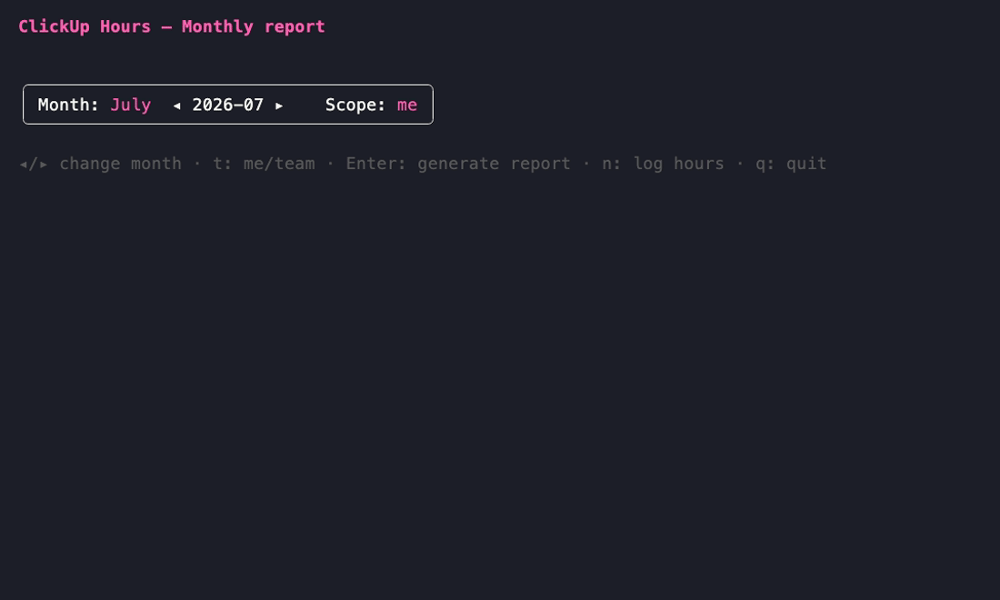

**English** · [Italiano](README.it.md)

# clickup — ClickUp Hours CLI

[](https://github.com/marcoarnulfo/clickup-cli/actions/workflows/ci.yml)
[](https://github.com/marcoarnulfo/clickup-cli/releases)
[](go.mod)
[](LICENSE)
[](CONTRIBUTING.md)

> A fast, colorful terminal TUI to pull your **monthly ClickUp hours** — self or team — compute the **billable amount**, and log time back to ClickUp. Free and open-source (MIT).

## Features

- 📊 **Monthly hours report** (self or whole team), grouped by total / task / list / day.
- 💶 **Billable amount** from a default hourly rate, with **per-list rates** overrides.
- ⏱️ **Log hours** back to ClickUp from the TUI: guided (list → task), by task ID/URL, or with a start/stop timer.
- 📤 **Export** to CSV / JSON / Markdown.
- ⌨️ Fully interactive, keyboard-driven TUI (built with [Charm](https://charm.sh) bubbletea).
- 🔒 Token stays local (config file or `CLICKUP_TOKEN` env var).

## Demo



Try it yourself without a ClickUp account: **`CLICKUP_DEMO=1 clickup`** runs a demo mode with
fixture data. The GIF is recorded with [vhs](https://github.com/charmbracelet/vhs) from
[`docs/demo.tape`](docs/demo.tape) (run `vhs docs/demo.tape` to regenerate).

## Requirements

- **[Go](https://go.dev/dl/) 1.26 or newer** — only needed to install/build from source.
  - macOS: `brew install go` · Linux: [official install](https://go.dev/doc/install) · check with `go version`.
- A **ClickUp personal API token** (ClickUp → Settings → Apps → API Token).

## Installation

```bash
go install github.com/marcoarnulfo/clickup-cli/cmd/clickup@latest
```

This installs the `clickup` binary into `$(go env GOPATH)/bin` (make sure it's on your `PATH`).

<details>
<summary>Build from source</summary>

```bash
git clone https://github.com/marcoarnulfo/clickup-cli.git
cd clickup-cli
go build -o clickup ./cmd/clickup
./clickup
```
</details>

## Quick start

1. **Install** (see above) and run `clickup`.
2. On first launch, the **setup wizard** asks for your API token, workspace, an optional hourly rate, and currency — saved to `~/.config/clickup-cli/config.yml`.
3. Pick a **range** (`d`) and **scope** (`me`/`team`) on the home screen, press `Enter` → your report. Press `n` to log hours, `e` to export, `p` for per-list rates.

## Usage

Run `clickup`. On first launch a setup wizard asks, in sequence: your personal API
token (find it in ClickUp → Settings → Apps → API Token), the workspace to use
(chosen among those visible to the token), an optional hourly rate, and the currency
(default `EUR`). The result is saved to `~/.config/clickup-cli/config.yml` and reused
on subsequent launches.

From the home screen pick a range and scope, then `Enter` generates the report. The
report is no longer limited to a calendar month: press `d` on the home screen to open
the **range picker**, which offers presets (this month, last month, last 7 days, last
30 days, this week) plus a **custom** `From`/`To` range (dates as `YYYY-MM-DD`). In the
report you can change the grouping, re-export, or go back home. If the token becomes
invalid or is revoked while in use, the TUI automatically re-runs the setup wizard.

### TUI commands

| Key | Screen | Action |
|---|---|---|
| `d` | Home | Open the **report range** picker (presets + custom from/to) |
| `◂` / `▸` (left/right arrows, also `h`/`l`) | Home | Change month (only while the `this month` range is active) |
| `t` | Home | Toggle scope `me` / `team` |
| `f` | Home | Open **member selection** (team scope): multi-select which members the report covers |
| `Enter` | Home | Generate the report for the selected range/scope |
| `g` | Report | Cycle grouping: total → task → list → day → member (team) → total |
| `e` | Report | Open the export menu (CSV/JSON/Markdown) |
| `m` / `s` | Report | Go back home to change range/scope |
| `r` | Report | Reload the time entries from the API for the same range/scope |
| `p` | Report | Open the **Per-list rates** screen |
| `f` | Report | Open the **Filters** screen (list/tag/status) |
| `n` | Home / Report | Open the **Log hours** screen (record time on ClickUp) |
| `↑`/`↓` (also `k`/`j`) | Export | Select the format |
| `Enter` | Export | Save `clickup-report-<period>.<ext>` in the cwd (`<period>` is `YYYY-MM` for a calendar month, or `YYYY-MM-DD_YYYY-MM-DD` for a custom range) |
| `Esc` | Export | Return to the report without exporting |
| `q` | Everywhere except setup / rates / range | Quit the application |
| `Ctrl+C` | Always | Quit the application |

The setup screen has no `q`-to-quit, to avoid pressing it by mistake while typing the
token: use `Ctrl+C`.

#### Per-list rates screen

From the report screen, pressing `p` opens the **Per-list rates** screen, where you can
configure a specific hourly rate for each list (different from the default). Available
commands:

- `↑` / `↓` (also `k` / `j`): navigate the lists
- `Enter`: edit the selected list's rate (digits and decimal separator only)
- `d`: reset the list to the default rate
- `s`: save changes and return to the report
- `Esc`: cancel (discard unsaved changes) and return to the report

Since v1.1, each amount is computed from the list's real hours multiplied by its specific
rate (not from the rounded hours), so a single amount may differ by a few cents from
`shown_hours × list_rate`; however, the billing total is always the exact sum of the
displayed amounts.

#### Filters screen

From the report screen, pressing `f` opens the **Filters** screen, with three
sections: Lists, Tags and Statuses. Each section lists the distinct values found
in the loaded entries; selecting one or more values in a section keeps only the
matching entries (OR within a section, AND across sections); leaving a section
empty means "no filter" for that dimension. Task statuses are not included in the
initial API load, so the first time you open Filters in a session the app fetches
each loaded task's current status from ClickUp (shown as "Loading statuses…");
after that it is cached for the rest of the session. Filters compose with the
team member selection and the active date range — they only narrow what is
already loaded. When the date range changes, filter selections automatically
adjust to the new entries: any selected value that no longer occurs is dropped,
so the report never gets stuck empty because of a stale filter. Available
commands:

- `Tab` / `Shift+Tab`: switch section
- `↑` / `↓` (also `k` / `j`): move within the section
- `Space`: toggle the highlighted value
- `a`: select/deselect all values in the section
- `Enter`: apply the filter and return to the report
- `Esc`: discard changes and return to the report

#### Log hours screen

Pressing `n` (from Home or Report) opens **Log hours**, to record time on your own
ClickUp tasks. Three modes:

1. **Guided** — pick a list among the known ones (current report ∪ config), then a task
   of that list, then fill in the form.
2. **Task ID/URL** — paste the task ID or a ClickUp URL (e.g. `.../t/86abc`) and go
   straight to the form.
3. **Timer** — start a stopwatch on the chosen task (guided or ID); pressing `s` stops it
   and ClickUp records the time entry. If a timer is already running when you open the
   screen, it is shown and you can stop it right away.

In the form, **duration** accepts flexible formats: `2h30`, `2h30m`, `1.5h`, `1,5h`,
`90m`, `45` (bare number = hours). The **date** defaults to today (`YYYY-MM-DD`, editable)
and the **note** is optional. Finally you set whether the entry is **billable** (`Y`/`n`,
default yes). After saving, press `r` to reload the report and see the new hours immediately.
You always log **your own** hours.

### Team scope

For the `team` scope the token must have Owner/Admin permissions on the workspace: without
them the API call fails and the error is shown on the error screen. The `team` scope
aggregates the hours of the workspace members; by default **all** members are included, but
you can press `f` from Home to open the member selection screen and pick individual members
(a partial selection shows a `(k/n members)` note in the report title).

## Configuration

Configuration persists in `~/.config/clickup-cli/config.yml` (it follows
`os.UserConfigDir()`, so it respects `XDG_CONFIG_HOME` on Linux):

```yaml
token: pk_xxx...
workspace_id: "123456"
currency: EUR
rate: 45
rates:
  "111": 60
  "222": 30
```

- `token`: personal ClickUp API token.
- `workspace_id`: id of the workspace (ClickUp team) chosen during setup.
- `currency`: currency used in the report and exports.
- `rate`: default hourly rate used to compute the billable amount.
- `rates` (optional): a `list_id: rate` map with per-list hourly rates. Lists not listed
  use the default `rate`. The map is conveniently filled from the TUI by pressing `p` on
  the report screen.

The `CLICKUP_TOKEN` environment variable, when set, always overrides the `token` read from
the config file (handy for CI or to avoid saving the token to disk):

```bash
CLICKUP_TOKEN=pk_xxx clickup
```

## Contributing

Contributions are very welcome — this is a free, open-source project. See
**[CONTRIBUTING.md](CONTRIBUTING.md)** for how to set up the dev environment, run the
tests, and open a PR. New here? Look for the
[`good first issue`](https://github.com/marcoarnulfo/clickup-cli/issues?q=is%3Aissue+is%3Aopen+label%3A%22good+first+issue%22)
label. Please also read the [Code of Conduct](CODE_OF_CONDUCT.md).

## Roadmap

Roadmap and backlog live in **[GitHub Issues](https://github.com/marcoarnulfo/clickup-cli/issues)**
(labels `roadmap`/`enhancement`, milestones `v1.3` / `v2.0`). Highlights: custom date
ranges (v1.3), weekly summaries, invoice export, multi-currency (v2.0).

## License

[MIT](LICENSE)
